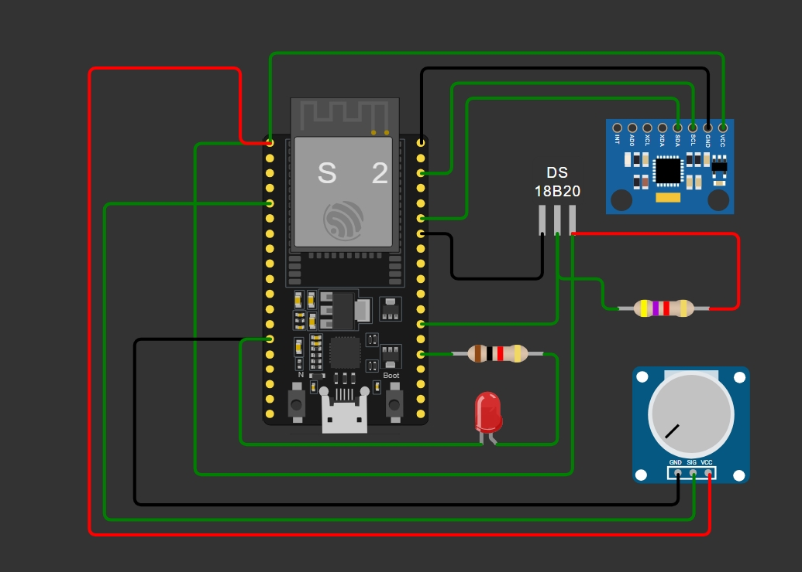

# Industrial Motor Condition and Energy Monitoring System

> An IoT-based monitoring system to track motor current, temperature, and vibration to reduce energy wastage and prevent unexpected failures.

---

## Project Links
- **Wokwi Simulation:** [View Project on Wokwi](https://wokwi.com/projects/457863990350535681)

## Components List

When creating a new ESP32 project in Wokwi, click the **"+"** button to add the following components:

| Component | Description |
|-----------|-------------|
| **ESP32** | The main microcontroller block/brain. |
| **MPU6050** | Accelerometer & Gyroscope for vibration/movement simulation. |
| **DS18B20** | 1-Wire sensor for measuring motor temperature. |
| **Potentiometer** | Used to simulate the motor's current draw. |
| **LED (Red) & 330Ω Resistor** | Acts as a fault alert/alarm indicator. |
| **4.7kΩ Resistor** | Pull-up resistor required for the DS18B20 data line. |

---

## How It Works

This system is designed to simulate a real-world predictive maintenance environment for industrial motors using the ESP32 microcontroller and the ThingsBoard IoT platform.

1. **Data Acquisition:**
   - **Vibration & Temperature:** The `MPU6050` sensor gathers X and Y-axis acceleration data (simulating machine vibration) and also provides ambient motor temperature readings.
   - **Motor Current:** A connected potentiometer acts as a dummy analog sensor to simulate current draw (0-50 Amps).
2. **Data Processing:**
   - The ESP32 collects the raw sensor readings and processes them into meaningful values.
   - It then formats this telemetry data into a structured **JSON** document using the `ArduinoJson` library.
3. **IoT Telemetry Transmission:**
   - The ESP32 connects to a Wi-Fi network and a ThingsBoard MQTT broker. 
   - Every 3 seconds, the ESP32 publishes the JSON payload to the MQTT topic `v1/devices/me/telemetry` so that the condition of the motor can be monitored remotely on a dashboard.

---

## Wiring Guide (Pin Connections)

### MPU6050 (I2C Communication)
| MPU6050 Pin | ESP32 Pin |
|-------------|-----------|
| **VCC**     | `3V3`     |
| **GND**     | `GND`     |
| **SDA**     | `GPIO 21` |
| **SCL**     | `GPIO 22` |

### DS18B20 (1-Wire Temperature)
| DS18B20 Pin | ESP32 Pin | Note |
|-------------|-----------|------|
| **VCC**     | `3V3`     | |
| **GND**     | `GND`     | |
| **DQ (Data)**| `GPIO 4` | **Important:** Connect the `4.7kΩ` pull-up resistor between the `VCC` and `DQ` pins. |

### Potentiometer (Simulated Current Sensor)
| Potentiometer Pin | ESP32 Pin |
|-------------------|-----------|
| **VCC** (Left)    | `3V3`     |
| **GND** (Right)   | `GND`     |
| **SIG/OUT** (Middle)| `GPIO 34` (Analog input) |

### Fault Alert LED
| LED Pin | ESP32 Pin / Connection |
|---------|------------------------|
| **Anode** (Long leg) | `GPIO 2` (via the `330Ω` resistor) |
| **Cathode** (Short leg)| `GND` |

---
*Created for Industrial Motor Monitoring & Predictive Maintenance.*
